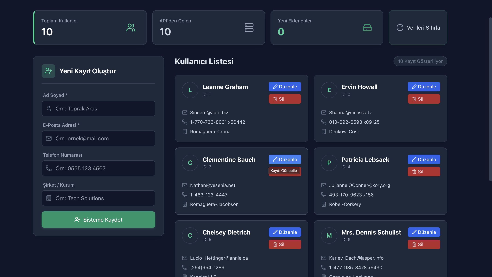

# Toprak Aras - CRUD Projesi

Bu proje React ve Vite kullanılarak hazırlanmış bir kullanıcı yönetim (CRUD) projesidir.

## Özellikler
- **Ekle (Create):** Form üzerinden yeni kullanıcı eklenebilir.
- **Listele (Read):** API'den gelen veriler ve kullanıcının eklediği veriler listelenir.
- **Güncelle (Update):** Kayıtlı kullanıcıların bilgileri "Düzenle" butonu ile değiştirilebilir.
- **Sil (Delete):** Kullanıcılar listeden silinebilir.
- **Veri Kalıcılığı:** Tüm değişiklikler (Ekleme, Silme, Güncelleme) tarayıcının `LocalStorage` bölümüne kaydedilir, sayfa yenilendiğinde veriler kaybolmaz.

## Ekran Görüntüleri

## Klasör Yapısı
Projede yönergeye uygun olarak `src` altında şu dizinler mevcuttur:
- `/Components`
- `/Pages`
- `/Interfaces`

## Kurulum
1. Proje dizininde `npm install` komutunu çalıştırın.
2. `npm run dev` ile uygulamayı başlatın.

